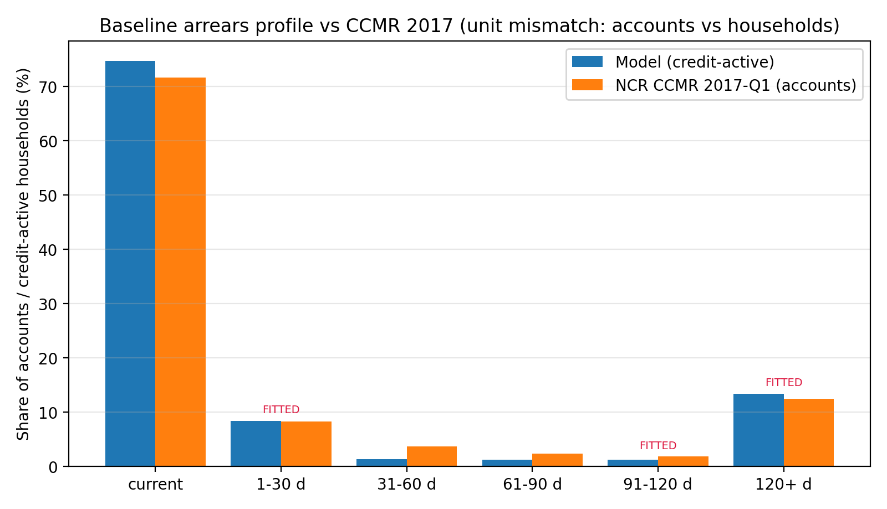
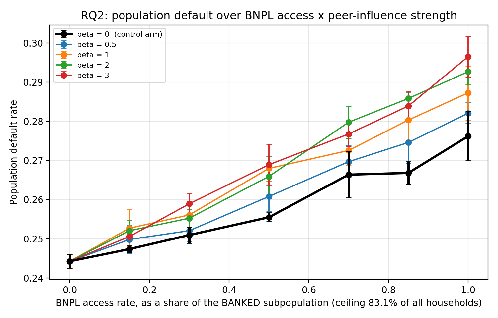
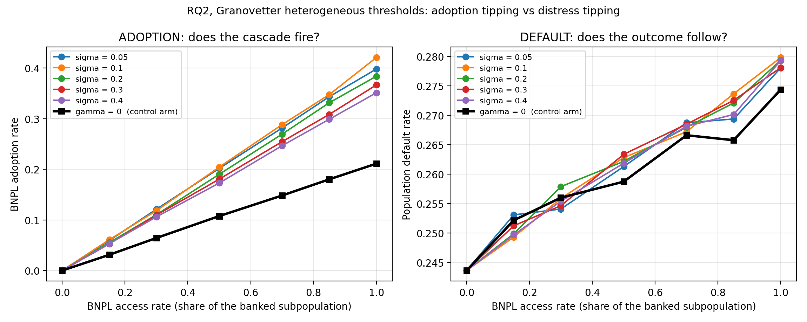
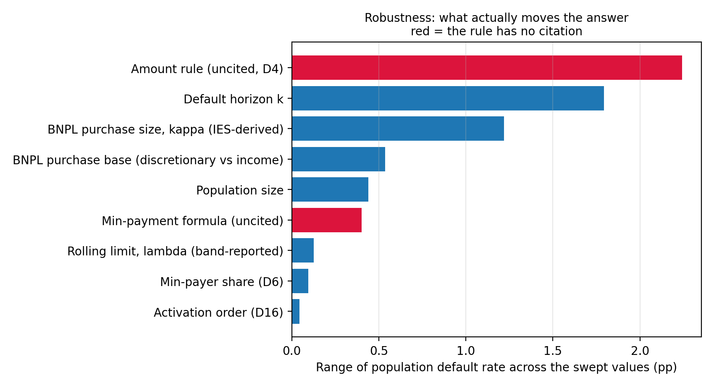

# Simulation status

**13 August 2026.** Where the model is, what it's built from, and what it's produced so far. This covers the simulation only, not the write-up.

> **Write-up status, 18 August 2026.** The word limit is **10,000**, and the thesis has been
> restructured to fit it: chapters became sections, the research questions were renumbered, and the
> body now projects to 9,605 words. See
> [`scratchpad/SCOPE_REDUCTION.md`](scratchpad/SCOPE_REDUCTION.md). The findings below are
> unaffected — only their labels moved. Two items in §8 remain and should be done together before
> the results section is written: cap the shortfall borrowing path, then the final run.

---

## 1. Where things stand

The model is built, calibrated, and has produced a full set of results. 91 automated tests pass.

Since the first run I found and fixed four defects, and rebuilt the two parameters that were driving most of the output. I re-ran everything with BNPL switched on. The numbers below are from that re-run: 950 runs at 5 replicates each. It's a working sweep, not a final one. Replicate noise is 0.33 percentage points, so I'm treating any difference smaller than about 0.67pp as noise.

---

## 2. What the model does

Five ideas, and that's the whole model:

1. A household earns money, must pay for food and rent, and may owe debt.
2. Sometimes an earner loses their job. That's the only bad thing that happens.
3. A bank lends only if a legal affordability test passes.
4. BNPL providers don't run that test, don't report to the credit bureau, and can't see each other.
5. Households are more likely to use BNPL when people around them do.

A household defaults when it can't cover food plus debt service for seven fortnights running.

Item 4 is the core of the design. The bank checks the credit bureau, the bureau holds no BNPL debt, so the bank can't see it. Neither can the other BNPL providers. That's what lets a household build up several BNPL facilities at once, I didn't program that behaviour in, it falls out of the setup.

---

## 3. What data it uses

| Source | Year | What it gives |
| --- | --- | --- |
| NIDS Wave 5 | 2017 | The households themselves: income, food and rent, other spending, savings, debt, earners |
| FinScope | 2019 | Whether a household is banked and has formal credit. Categories only, no money |
| NCR Consumer Credit Market Report Q1 | 2017 | The arrears profile the model is calibrated against |
| Stats SA Labour Market Dynamics | 2017 panel | Real job separation rates, used as a sanity band |
| Stats SA Income and Expenditure Survey | 2022/23 | Share of spending on the goods BNPL finances |
| Weaver Fintech Integrated Report | 2025 | Average BNPL order value and purchase frequency |
| Stats SA CPI | 2026 | Converts current prices into 2017 Rands |

Every household in the simulation is a real NIDS household, given financial inclusion flags copied from a similar FinScope respondent, then drawn 5,000 times in proportion to how many real households it represents. Fourteen checks on that population all pass.

Everything is in 2017 Rands. Where a source is more recent, I only take a ratio from it, never an amount, so the vintage can't leak in. The one exception is the published BNPL fees and caps, which are current prices, I deflate those once using a documented CPI factor.

---

## 4. Decisions made recently, and why

**BNPL purchase size is now derived from the household, not imposed on it.** It used to be a flat R1,568 for everyone, taken from trade press. That figure is 127% of the median poor banked household's entire monthly discretionary budget. I now draw a purchase around 13.87% of that household's own monthly discretionary spending — the share South African households actually spend on the categories BNPL finances, computed from the Income and Expenditure Survey.

**I turned the level of that rule into a test, and it passes.** Weaver Fintech discloses cumulative BNPL sales of R13.1bn over 9.4m transactions. Dividing gives an average order of R992 in 2017 Rands. The trade press figure works out at R1,038. The model, whose scale comes from the expenditure survey and nothing else, produces R1,029. Three independent sources within 5% of each other, with nothing tuned to get there.

**Credit limits are now a function of income, not a flat number.** They used to be R5,000 per provider, at each of four providers — 217% of the median poor banked household's monthly income. They're now a tenth of monthly income per provider. I set that value so the total across four providers matches the roughly £1,000 of invisible BNPL debt the FCA's Woolard Review found it easy to accumulate.

**Everything BNPL was in the wrong year's money.** The purchase size, the R15,000 order cap and the R95 weekly late fee were all current prices used unchanged in a 2017 model. Prices rose about 44% over that gap, so the BNPL side was inflated by roughly a factor of 1.4 against the households it was lending to. Fixed with a single documented CPI factor.

**Three bugs fixed.** The statutory 14-day cool-off was blocking nothing due to an off-by-one error, so it reported exactly zero effect. Households could make BNPL purchases partly funded by money they didn't have, because the checkout payment was deducted without a balance check. And the peer influence signal was diluted by households who can't use BNPL at all, which would have corrupted the Granovetter test.

**I added the Granovetter threshold model**, as pre-registered. Each household gets its own tipping point and ignores its peers until the group crosses it. This tests whether the linear peer rule was producing a linear answer purely because it's linear.

---

## 5. Proof it works

### Calibration

Two parameters are fitted, the job loss rate and a payment inattention rate, each to one arrears band. Three other bands are left free as independent checks.

The chart compares the model against the National Credit Regulator's published arrears figures for the first quarter of 2017. The 90+ day band is 14.20% against the regulator's 14.21%, but that one was fitted, so it doesn't prove much on its own.

**The 60+ day band is the one that matters: 15.38% against 16.54%, and it was never fitted.** Two parameters were tuned to two other numbers and this one came out close by itself.

### Independent checks the model was not tuned to

| Check | Model | Target | Source |
| --- | --- | --- | --- |
| 60+ day arrears | 15.38% | 16.54% | NCR 2017 |
| Households holding 2+ BNPL facilities | 15% to 39% | 32% | US CFPB |
| BNPL spend per user per year | R3,015 | R1,333 to R4,261 | Weaver 2025 |
| Average BNPL purchase | R893 | R992 | Weaver 2025 |
| Does BNPL worsen traditional debt | yes, +2.9 to +3.5pp | direction only | de Haan et al. |
| Debt to income peaks in the middle | peaks at Q4 | middle peak | Hamill et al. |
| Households reaching zero savings | 45% | 36% | TransUnion |

Six of seven pass. The last is the same order of magnitude but high, and it rests on the weakest variable in the dataset.

### Sanity checks against known answers

With one BNPL provider, stacking is exactly zero. With BNPL switched off, the model reproduces the baseline bit for bit. With peer influence switched off, it reproduces a model of completely independent households bit for bit. These are automated tests, not spot checks.

---

## 6. Headline results

### BNPL raises default by 3 to 5 percentage points

Default is 24.2% with no BNPL, 27.2% with it, and 29.1% with it plus strong peer influence.

Each line is a different strength of peer influence, and the black line is the control with peer influence switched off. Default rises smoothly with access in every case. There's no cliff edge anywhere on this chart.

This falsifies the registered hypothesis for research question 2, which expected a sudden jump past some level of BNPL access. There's a structural reason for it: the model has no way for one household's default to hurt another, so default is an individual event happening to many households at once. A sudden jump would need feedback in the outcome, and there is none by design.

### Peer influence changes who uses BNPL, not who defaults

This is the pre-registered Granovetter test. On the left, adoption roughly doubles when peer influence is on, from 21% to 42%. On the right, default barely moves — about half a percentage point. The black line in each panel is the control.

The adoption line is also almost perfectly straight, with an R² of 0.9999. Even giving every household its own tipping point doesn't produce a cascade, because thresholds firing at the household level average out across 45 reference groups.

Two structurally different social mechanisms, and neither produces a sudden jump in adoption or in default.

**People catch BNPL from their neighbours. They don't catch financial distress from them.**

### The policy levers

| Lever | Effect on BNPL borrowing |
| --- | --- |
| Make BNPL visible to credit bureaux | Essentially none, about 1% |
| Require an affordability check on BNPL | Essentially none |
| 14-day cool-off period | Nothing on its own, but −33% where peer influence is present |
| Cap on concurrent facilities | −54% to −63%, and default returns almost to the no-BNPL level |

The interventions regulators are proposing show little effect in this model. The one that works — a cap on concurrent facilities — isn't currently being proposed by any regulator I found. In the model, the damage doesn't come from any single BNPL loan being unaffordable; it comes from holding several at once. Disclosure only tells the bank something. An affordability test examines one loan in isolation. Neither touches how many facilities a household can hold. Only the cap does.

The cool-off works where peer influence is present because delaying purchases lowers the group's visible usage, which lowers everyone else's appetite. It acts on the social loop rather than on the individual.

The bureau visibility result survived a complete rebuild of the two parameters underneath it.

### What actually drives the results

Each bar is how far the default rate moves across the plausible range of one parameter. Red means the rule has no citation behind it.

The two parameters I rebuilt this week used to be the top two bars, at 19.6 and 16.9 percentage points. They now move the answer by 2.06 and 0.18.

The largest remaining bar is the borrowing amount rule, at 4.11pp, discussed below.

---

## 7. Known problems

**The job loss rate is about four times the real one.** To reproduce real arrears the model needs a job separation rate well above what the labour force survey records. The reason is structural: this model has one thing that can go wrong, where real households fall behind because of illness, unexpected bills, rate rises and family changes as well. One channel is doing the work of several. This is disclosed and not fixable within the current design.

**The largest remaining sensitivity is a rule with no citation.** When a household comes up short, how much does it ask to borrow? The model offers three answers: exactly the shortfall, the shortfall plus 25%, or the shortfall plus a period of food and rent. The literature search found no study that settles this.

The first two options give 28.91% and 28.24%, which agree to within the noise floor. The whole 4.11pp range comes from the third and most generous option. Two plausible versions agree, and one outlier stretches the range.

That rule governs the path where a household borrows to cover a shortfall, and that's the one place where BNPL draws are still not capped against what the product could plausibly finance. Capping it is the next modelling change I'd make.

**Agents interact only weakly.** Each household sees its group's average behaviour, never another household individually. This is a recognised form of agent-based model, and Granovetter's threshold models work the same way, but it's worth stating plainly. There's no South African data on who influences whom, so building a real social network would mean inventing several unmeasurable numbers.

**The model can't produce a systemic cascade.** There's one lender with no balance sheet that can fail, no feedback from default to income, and no channel by which distress spreads. What it produces is many independent defaults happening at once, which is worth having but is not a cascade.

**Two smaller things.** The credit limit binds on 54% of requests but barely moves default, because a constrained household borrows less per purchase rather than defaulting less. Both facts need reporting together or it reads as a contradiction. And the CPI series is taken from published Stats SA releases rather than re-derived from the underlying index table, though it reproduces the published June 2026 index to within 0.8%.

---

## 8. What is next

1. Cap the shortfall borrowing path, and replace the three borrowing amount options with a single parameter swept smoothly. Small change, and it addresses the largest remaining sensitivity.
2. Final run at 20 replicates, plus a full variance decomposition.
3. Results chapter, written once against the final numbers.

The modelling is close to done. Nothing on that list changes the direction of any result above.